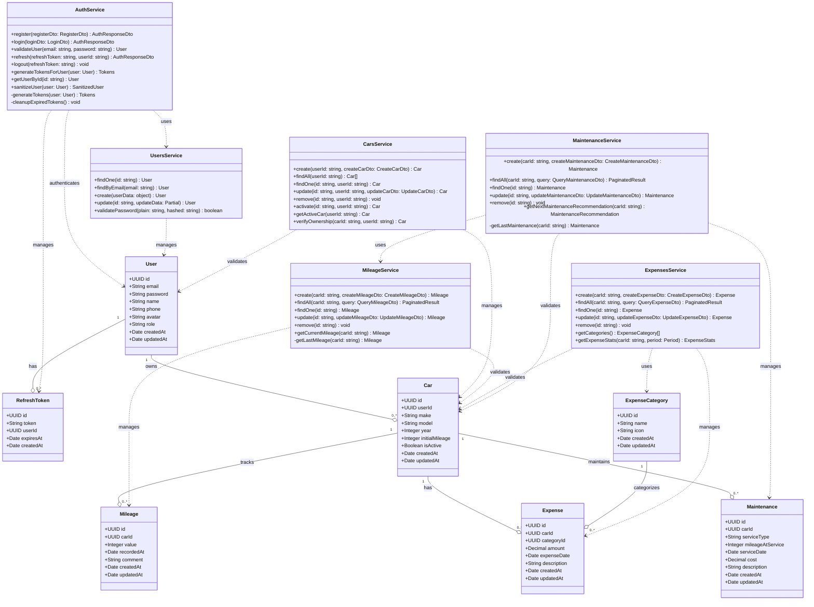

# CarLine Class Diagram

## UML Class Diagram with Entities and Key Methods

## Relationship Legend

### UML Relationships Used:

- **`--o`** (Aggregation): "has-a" relationship where the child can exist independently
  - Example: `User --o Car` (User has Cars, but Cars could theoretically exist without being tied to a specific user in the domain model)
- **`..>`** (Dependency): One class uses another class temporarily
  - Example: `AuthService ..> UsersService` (AuthService depends on UsersService methods)

### Multiplicity:

- `1` : Exactly one
- `0..*` : Zero or more
- `1..*` : One or more

## Key Features by Domain:

### Authentication & Users

- **User Management**: CRUD operations, password hashing and validation
- **Authentication**: JWT-based auth with refresh tokens, register/login/logout
- **Security**: Automatic cleanup of expired tokens

### Car Management

- **Car CRUD**: Full lifecycle management of user vehicles
- **Active Car**: System to mark one car as currently active
- **Ownership Verification**: Security checks for car-related operations

### Mileage Tracking

- **Mileage Records**: Track vehicle mileage over time
- **Validation**: Ensures new mileage is always greater than previous
- **Current Mileage**: Quick access to latest mileage reading

### Expense Management

- **Expense Tracking**: Record all vehicle-related expenses
- **Categorization**: Expenses organized by categories (fuel, maintenance, etc.)
- **Analytics**: Statistics by category and time period
- **Filtering**: Query expenses by date range and category

### Maintenance Management

- **Service Records**: Track all maintenance activities
- **Cost Tracking**: Monitor maintenance expenses
- **Smart Recommendations**: Automatic suggestions based on mileage and time
- **Integration**: Uses MileageService for intelligent recommendations

## Database Design Patterns:

- **UUID Primary Keys**: For distributed systems and security
- **Soft Relationships**: Foreign keys with proper indexes
- **Timestamps**: Automatic tracking of creation and modification times
- **Cascade Deletion**: RefreshToken automatically deleted when User is removed
- **Nullable Fields**: Optional descriptive fields (description, comment, etc.)
